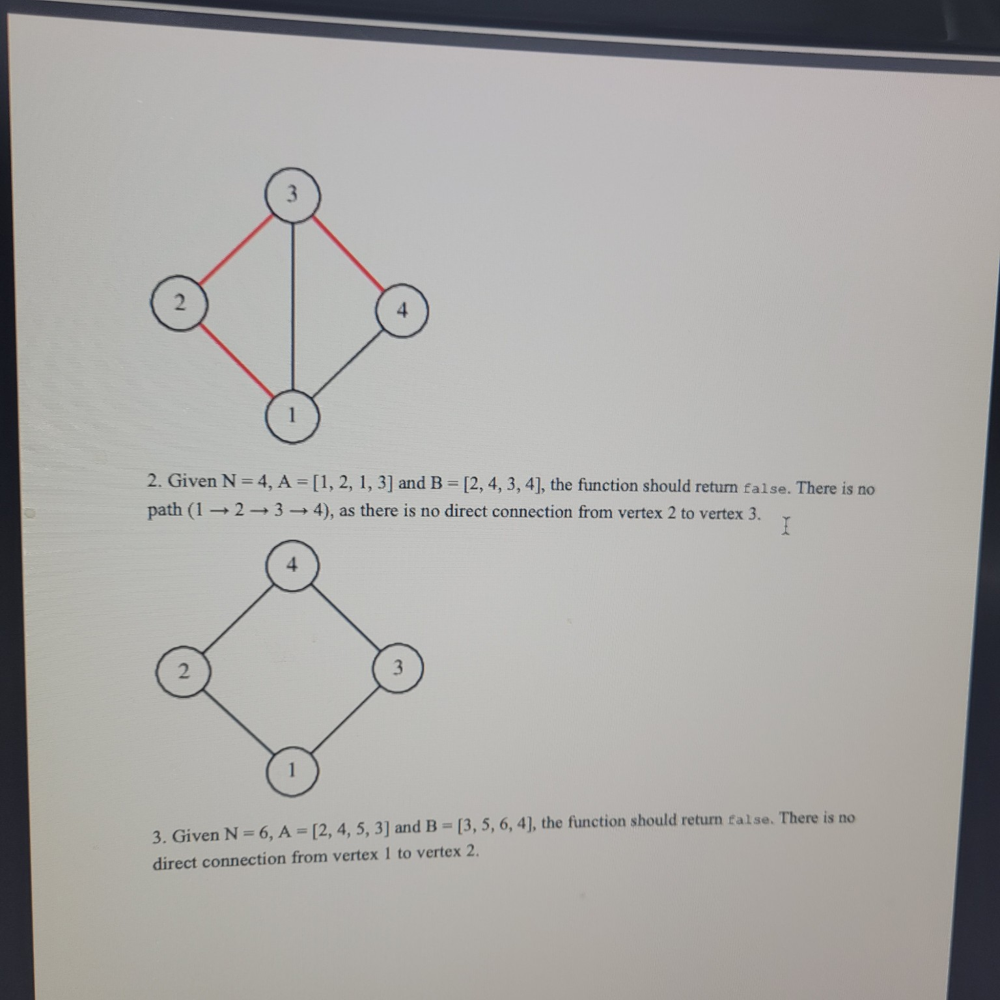

# PathDetection

**Medium**  
**50 min**  
Check whether the given graph contains a path going through all vertices, one by one, in increasing order of their numbers.

---

## Task description

You are given an undirected graph consisting of N vertices, numbered from 1 to N, and M edges.

The graph is described by two arrays, A and B, both of length M. A pair (A[K], B[K]), for K from 0 to M−1, describes an edge between vertex A[K] and vertex B[K].

Your task is to check whether the given graph contains a path from vertex 1 to vertex N going through all of the vertices, one by one, in increasing order of their numbers. All connections on the path should be direct.

---

## Write a function:

```ts
function solution(N, A, B);
```

that, given an integer N and two arrays A and B of M integers each, returns `true` if there exists a path from vertex 1 to N going through all vertices, one by one, in increasing order, or `false` otherwise.

---

## Examples:

1. Given `N = 4`, `A = [1, 2, 4, 4, 3]` and `B = [2, 3, 1, 3, 1]`, the function should return `true`.  
   There is a path (1 → 2 → 3 → 4) using edges (1, 2), (2, 3) and (3, 4).

2. Given `N = 4`, `A = [1, 2, 1, 3]` and `B = [2, 4, 3, 4]`, the function should return `false`.  
   There is no path (1 → 2 → 3 → 4), as there is no direct connection from vertex 2 to vertex 3.

3. Given `N = 6`, `A = [2, 4, 5, 3]` and `B = [3, 5, 6, 4]`, the function should return `false`.  
   There is no direct connection from vertex 1 to vertex 2.

4. Given `N = 3`, `A = [1, 3]` and `B = [2, 2]`, the function should return `true`.  
   There is a path (1 → 2 → 3) using edges (1, 2) and (3, 2).

---

## Write an efficient algorithm for the following assumptions:

- N is an integer within the range [2..100,000];
- M is an integer within the range [0..100,000];
- all elements of arrays A and B are integers within the range [1..N];
- there are no self-loops (edges with A[K] = B[K]) in the graph;
- there are no multiple edges between the same vertices.



## PathDetection

**Step-by-Step Explanation**

### 1. Problem Restatement

Given an undirected graph on vertices $1$ through $N$, check whether there is a path

$$
1 \;\to\; 2 \;\to\; 3 \;\to\; \cdots \;\to\; N
$$

such that **each** consecutive pair $(i, i+1)$ is connected by **a direct edge**.

### 2. Key Insight

We do **not** need to search arbitrarily; the only possible valid path is the strictly increasing sequence $1,2,3,\dots,N$. Thus the graph must contain every edge $\{i,\,i+1\}$ for $i=1\ldots N-1$. If **any** of those edges is missing, the required path does not exist.

### 3. Algorithm

1. **Build** a constant-time lookup (a `Set`) of all edges in the graph.
2. **Test** for each $i$ from $1$ to $N-1$ whether the edge $(i,\,i+1)$ exists.
3. If **all** are present, return `true`; otherwise return `false`.

This runs in **O(M + N)** time and **O(M)** space.

---

### 4. TypeScript Implementation

```ts
function solution(N: number, A: number[], B: number[]): boolean {
  // 1) Build a set of edges for O(1) membership tests
  const edges = new Set<string>();
  for (let k = 0; k < A.length; k++) {
    const u = A[k], v = B[k];
    edges.add(`${u}#${v}`);
    edges.add(`${v}#${u}`);
  }

  // 2) Check each required consecutive edge (i, i+1)
  for (let i = 1; i < N; i++) {
    if (!edges.has(`${i}#${i+1}`)) {
      return false;
    }
  }

  // 3) All found
  return true;
}
```

---

### 5. Example Walkthrough

* **Example 1**
  $\;N=4,\; A=[1,2,4,4,3],\; B=[2,3,1,3,1]$
  Edges present (undirected):
  $\{1,2\},\{2,3\},\{1,4\},\{3,4\},\{1,3\}$.
  We need $\{1,2\},\{2,3\},\{3,4\}$ — all are present → **true**.

* **Example 2**
  $\;N=4,\; A=[1,2,1,3],\; B=[2,4,3,4]$
  Present: $\{1,2\},\{1,3\},\{2,4\},\{3,4\}$.
  Missing $\{2,3\}$ → **false**.

* **Example 3**
  $\;N=3,\; A=[1,3], B=[2,2]$
  Present edges: $\{1,2\},\{2,3\}$ (note we add both directions).
  Needed: $\{1,2\},\{2,3\}$ → **true**.

---

**Complexities**

* **Time:** O(M + N)
* **Space:** O(M)

This handles up to $N,M=100{,}000$ efficiently.
